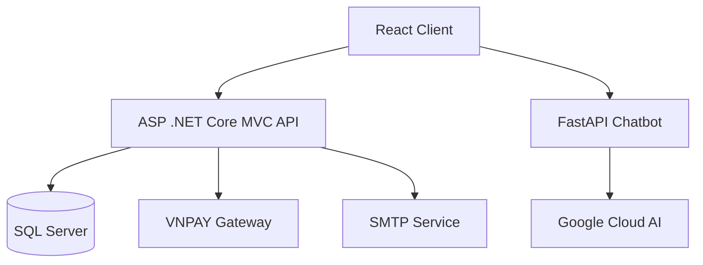

# 🎯 Web Shoes Store - HTShop


[](https://github.com/your-username/web-shoe-store/actions) [](LICENSE) [](#chatbot-integration) [](#ai--chatbot)

## 🗂️ Table of Contents

* [🚀 Project Overview](#project-overview)
* [✨ Features](#features)
* [💻 Tech Stack](#tech-stack)
* [📐 Architecture](#architecture)
* [⚙️ Getting Started](#getting-started)

  * [🔧 Prerequisites](#prerequisites)
  * [🛠️ Installation](#installation)
  * [⚙️ Configuration](#configuration)
  * [▶️ Running the Application](#running-the-application)
* [🤖 Chatbot Integration](#chatbot-integration)
* [🔌 API Endpoints](#api-endpoints)
* [🗄️ Database Schema](#database-schema)
* [🧪 Testing](#testing)
* [🚀 Deployment](#deployment)
* [🤝 Contributing](#contributing)
* [📄 License](#license)
* [✉️ Contact](#contact)

---

## 🚀 Project Overview

Web Shoe Store is a full-cycle e-commerce platform designed for shoe retailers. It enables product catalog management, order processing, customer and inventory management, real-time sales reporting, and secure payment processing. Additionally, a customer-service chatbot powered by FastAPI and Google Cloud AI provides instant support and guidance.

## ✨ Features

* 🛍️ **Product Management:** Create, update, and remove products with images and categories.
* 📦 **Order Processing:** Shopping cart, order checkout, and order history.
* 👥 **Customer Management:** User registration, authentication, profiles.
* 📊 **Inventory Management:** Track stock levels, warehouse locations, low-stock alerts.
* 📈 **Reporting Dashboard:** Real-time sales charts, best-selling products, revenue summaries.
* 💳 **Payment Integration:** VNPAY gateway for secure transactions.
* 📧 **Email Notifications:** Order confirmations and status updates via SMTP.
* 🤖 **Chatbot Support:** AI-driven customer assistance via FastAPI & Google Cloud AI.

## 💻 Tech Stack

| 🔨 Layer        | 🛠️ Technology                               |
| --------------- | -------------------------------------------- |
| 🖥️ Front-end   | ReactJS, TypeScript, HTML5, CSS, Bootstrap   |
| 🔙 Back-end     | ASP .NET Core MVC, FastAPI (Chatbot API)     |
| 🗄️ Database    | Microsoft SQL Server                         |
| 🧠 AI & Chatbot | Google Cloud AI (Dialogflow / Generative AI) |
| 🛠️ Dev Tools   | GitHub, Visual Studio                        |

## 📐 Architecture



## ⚙️ Getting Started

### 🔧 Prerequisites

* [.NET 7 SDK](https://dotnet.microsoft.com/download)
* [Node.js v16+](https://nodejs.org/)
* [Python 3.8+](https://www.python.org/downloads/)
* SQL Server instance (local or cloud)
* Google Cloud account with AI permissions
* VNPAY merchant account credentials

### 🛠️ Installation

1. **Clone the repo**

   ```bash
   git clone https://github.com/your-username/web-shoe-store.git
   cd web-shoe-store
   ```

2. **Front-end Setup**

   ```bash
   cd client
   npm install
   ```

3. **Back-end Setup**

   ```bash
   cd ../server
   dotnet restore
   ```

4. **Chatbot API Setup**

   ```bash
   cd ../chatbot
   python -m venv env
   source env/bin/activate  # macOS/Linux
   env\Scripts\activate   # Windows
   pip install -r requirements.txt
   ```

### ⚙️ Configuration

1. Copy `.env.example` to `.env` in both `server` and `chatbot` folders.
2. Fill in your:

   * `SQL_CONNECTION_STRING`
   * `VNPAY_API_KEY` and `VNPAY_SECRET`
   * `SMTP_HOST`, `SMTP_USER`, `SMTP_PASSWORD`
   * `GOOGLE_CLOUD_PROJECT`, `GOOGLE_CLOUD_CREDENTIALS_JSON`

### ▶️ Running the Application

```bash
# Start SQL Server and ensure it is accessible
# Run database migrations
cd server
dotnet ef database update

# Launch back-end API
dotnet run

# Launch chatbot API
cd ../chatbot
uvicorn main:app --reload

# Start front-end
cd ../client
npm start
```

Visit `http://localhost:3000` in your browser.

## 🤖 Chatbot Integration

The chatbot runs on FastAPI and connects to Google Cloud AI:

1. **Endpoint:** `POST /chatbot/query`
2. **Request Body:**

   ```json
   {
     "message": "User's question here"
   }
   ```
3. **Processing:** FastAPI forwards the message to Google Dialogflow / Generative AI, then returns the AI-generated response.
4. **Response:**

   ```json
   {
     "reply": "Hello! How can I help you today?"
   }
   ```

## 🔌 API Endpoints

| Method | Endpoint               | Description                |
| ------ | ---------------------- | -------------------------- |
| GET    | `/api/products`        | List all products          |
| GET    | `/api/products/{id}`   | Get product details        |
| POST   | `/api/auth/register`   | Register a new user        |
| POST   | `/api/auth/login`      | User login, returns JWT    |
| POST   | `/api/orders`          | Create a new order         |
| GET    | `/api/orders/{userId}` | Get orders for user        |
| POST   | `/chatbot/query`       | Send message to AI chatbot |

## 🗄️ Database Schema


## 🧪 Testing

* **Unit Tests (C#):**

  ```bash
  cd server
  dotnet test
  ```
* **Integration Tests (Python):**

  ```bash
  cd chatbot
  pytest
  ```

## 🚀 Deployment

1. Build and publish the back-end:

   ```bash
   cd server
   dotnet publish -c Release
   ```
2. Containerize with Docker (optional):

   ```bash
   docker build -t web-shoe-store-server ./server
   docker build -t web-shoe-store-chatbot ./chatbot
   ```
3. Deploy to cloud (Azure/AWS/GCP) or your hosting of choice.

## 🤝 Contributing

1. Fork the repository
2. Create a feature branch (`git checkout -b feature/YourFeature`)
3. Commit your changes (`git commit -m "Add YourFeature"`)
4. Push (`git push origin feature/YourFeature`)
5. Open a Pull Request

## 📄 License

This project is licensed under the MIT License. See [LICENSE](LICENSE) for details.

## ✉️ Contact

* **Maintainer:** Your Name (`your.email@example.com`)
* **GitHub:** [your-username](https://github.com/your-username)
